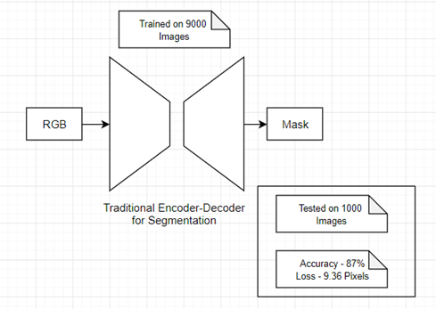

# Flood-Filling-Networks

This is our take on Flood filling network to improve accuracy of traditional Segmentation networks

Traditional architecture for segmentation, which was trained on 9000 images and tested on 1000 images.

Our Architecture(of two neural nets) was trained on collectively 9000 images and tested on 1000 images.

## Idea Doc
[Idea](https://github.com/hasagar97/Flood-Filling-Networks/tree/master/files/idea.pdf)

## Presentation
[Idea](https://github.com/hasagar97/Flood-Filling-Networks/tree/master/files/ppt.pdf)

## Conclusion

- The traditional model was fine-tuned and catered for better accuracy, and it was trained on 9000 images, 
- Our architecture used the original model and trained the traditional model on 5000 images, generated predictions for 4000 images and used these 4000 images to train the FFN. The FFN wasn't fine-tuned and catered for accuracy but still the architecture was able to overperform the Traditonal Model.

- Also our architecture is computationaly easy to train.(complexity of FFN is less than NN1)

